# Arcanum Audio

[](https://github.com/Almantask/rpg-audio-mixer-web/actions/workflows/ci.yml)

**Arcanum Audio** is a web RPG ambience and sound-mixing app for Dungeon Masters and tabletop storytellers. Layer loopable soundscapes with a low-latency soundboard, organize work into campaigns and sessions, and mix live from the Active Scene desk.

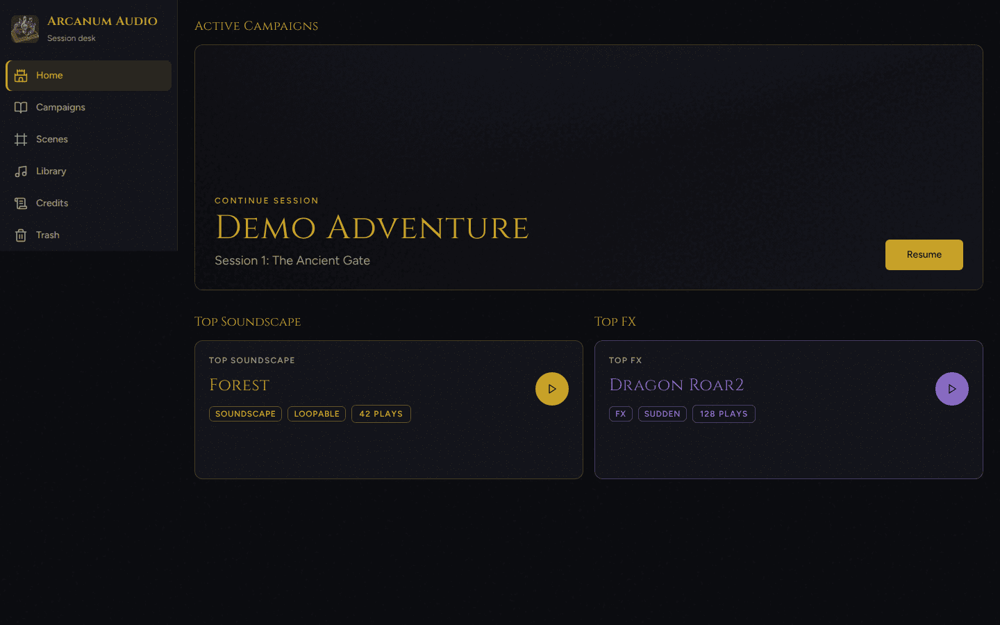

## Current features

A first launch seeds a **Demo Adventure** campaign with bundled forest, combat, and rain soundscapes plus a soundboard of one-shot FX, so the mixer is ready to try immediately.

### Home dashboard

Resume the campaign you last played, preview the most-used soundscape category and FX, and jump back into the session desk without hunting through lists.

### Campaigns and sessions

Organize prep into campaigns and dated sessions. Resume a campaign, add cover art, and keep a last-active session marked so the next table is one click away.

| Campaigns | Sessions |
| --- | --- |
| 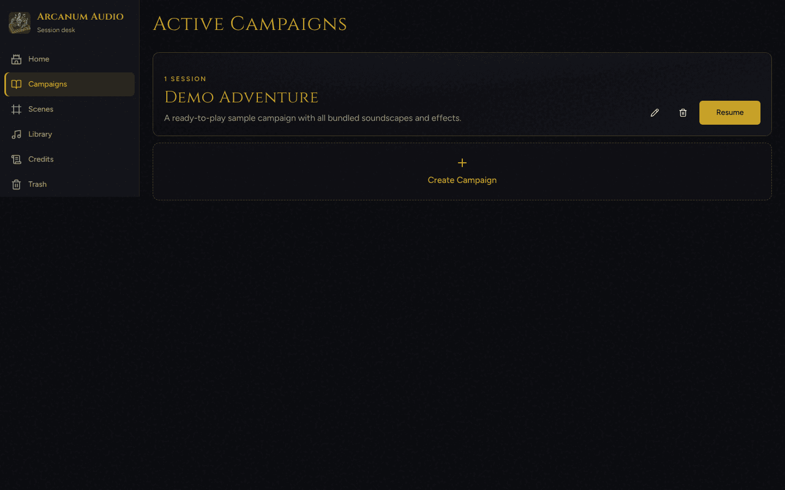 | 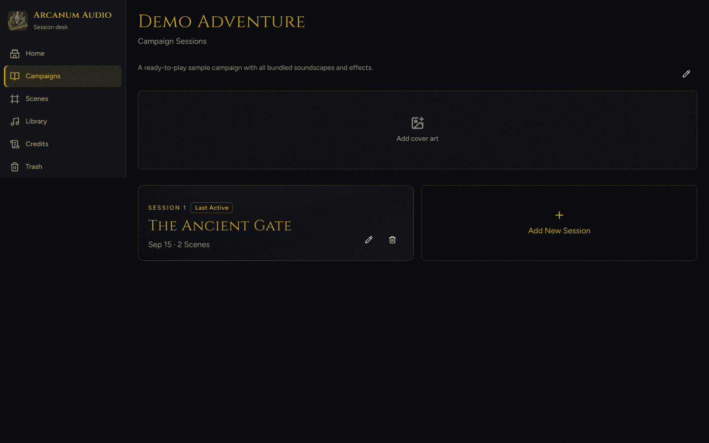 |

Session scene lists attach reusable scenes to a sitting, with tags, clone, import, and last-active badges.

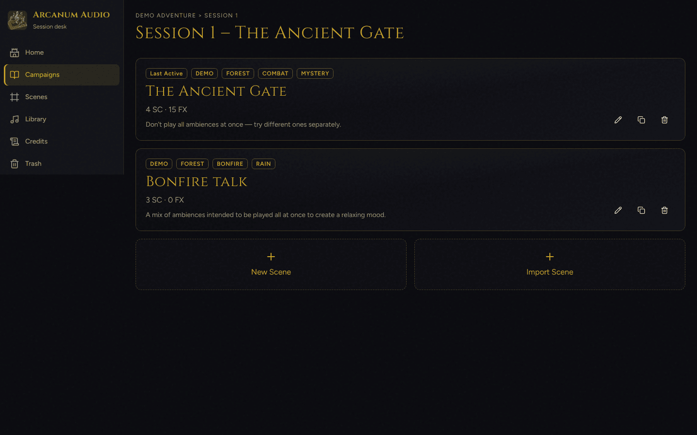

### Scenes

Build a global scene catalog, search by name or tag, and open any scene in the live mixer. Demo scenes ship with forest, combat, mystery, bonfire, and rain tags already wired.

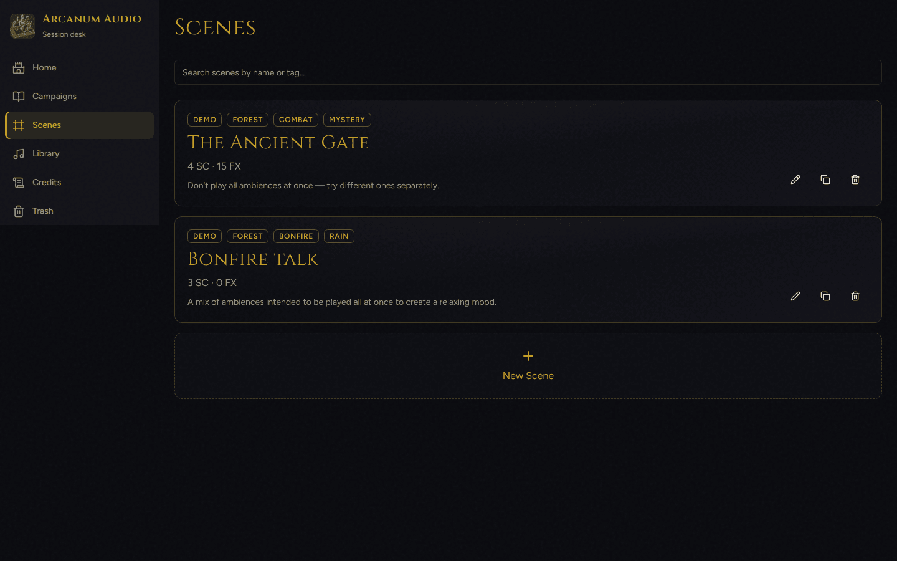

### Active Scene mixer

The mixing desk has two tabs:

- **Soundscapes** — layered loopable categories with per-slot volume, intensity I–III (calm / tension / climax), master volume, mute, and Play Scene
- **Soundboard** — overlapping one-shot FX tiles with hotkeys, master volume, and Stop All

| Soundscapes | Soundboard |
| --- | --- |
| 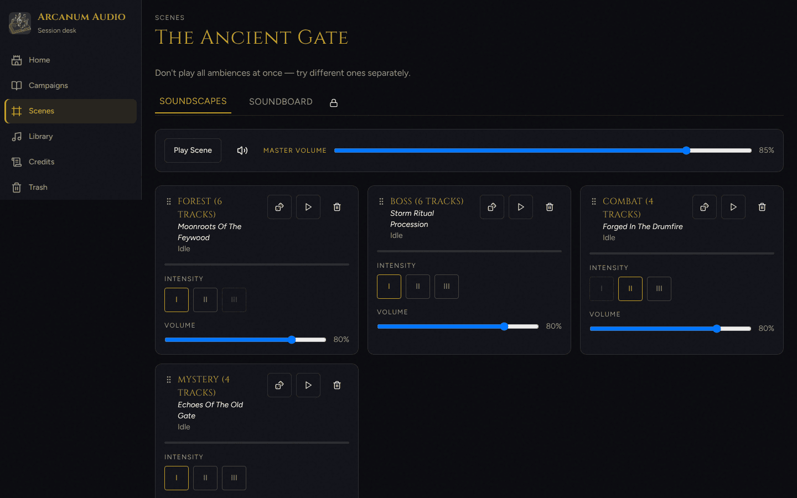 | 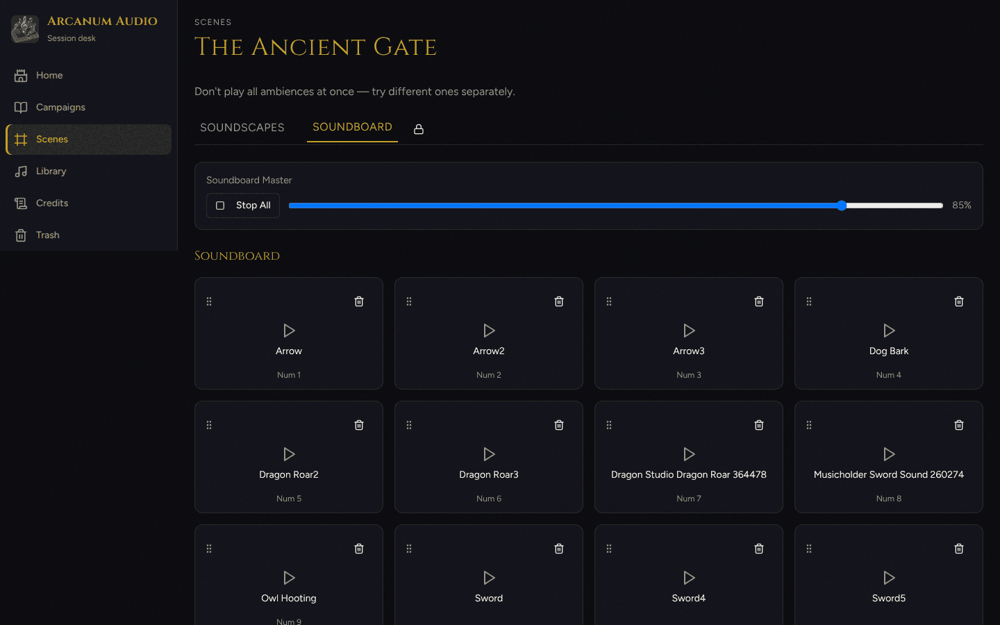 |

Playback uses the **Web Audio API** with cubic perceived-loudness curves and ~2s soundscape crossfades.

### Library

Browse and manage three libraries:

- **Soundscapes** — categories with intensity-level preview (I–III), free compositions, and a category composer
- **Sound Effects** — tagged FX with search, import, and audition
- **Tracks** — local audio plus YouTube / playlist import for looping beds

| Soundscapes | Sound Effects |
| --- | --- |
| 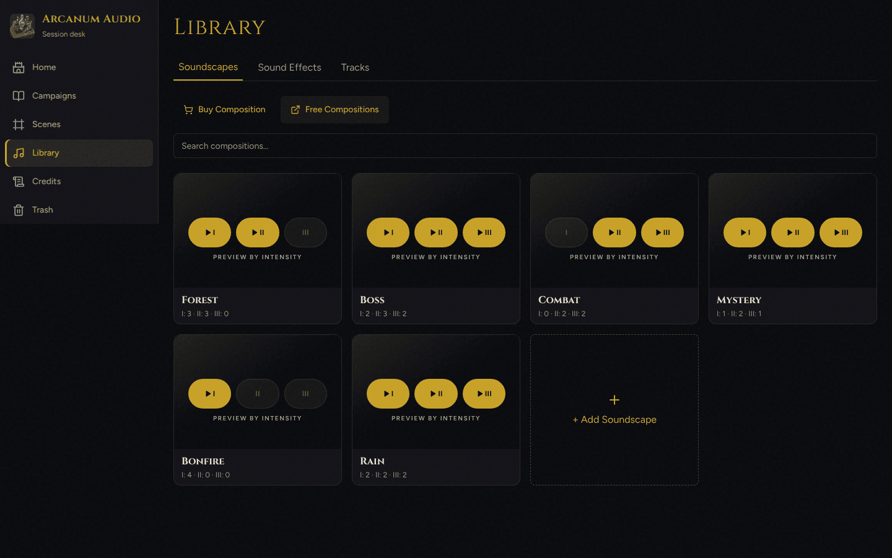 | 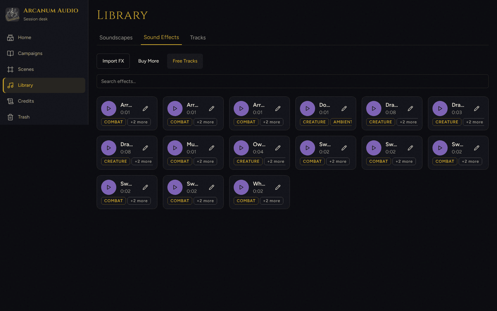 |

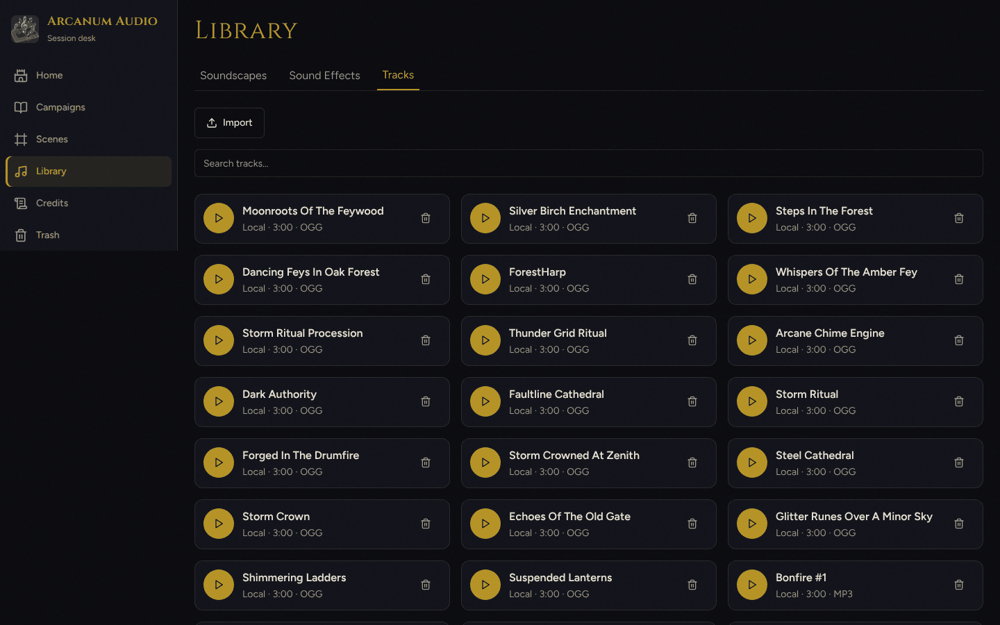

The **Category Composer** assigns tracks to intensity levels I–III for a soundscape category (for example Forest: calm beds on I, denser beds on II).

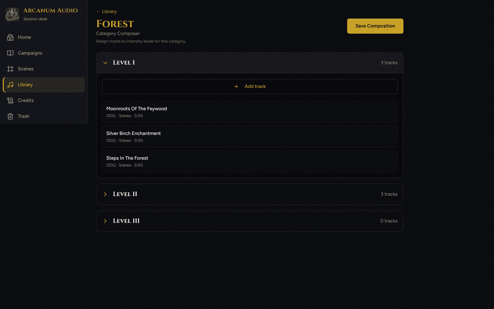

Supported import formats include `.mp3`, `.wav`, `.ogg`, and `.flac`, plus YouTube URLs with metadata lookup.

### Trash and recovery

Soft-delete campaigns, sessions, scenes, soundscapes, tracks, and FX. Restore or permanently purge within 7 days; bulk restore and empty-trash actions are available from the same screen.

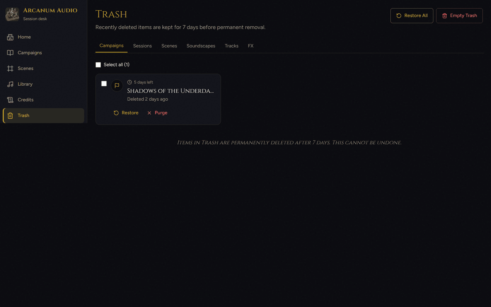

### Credits and legal

Support development, leave a review, and open Terms, Privacy, and audio/open-source attributions from Credits.

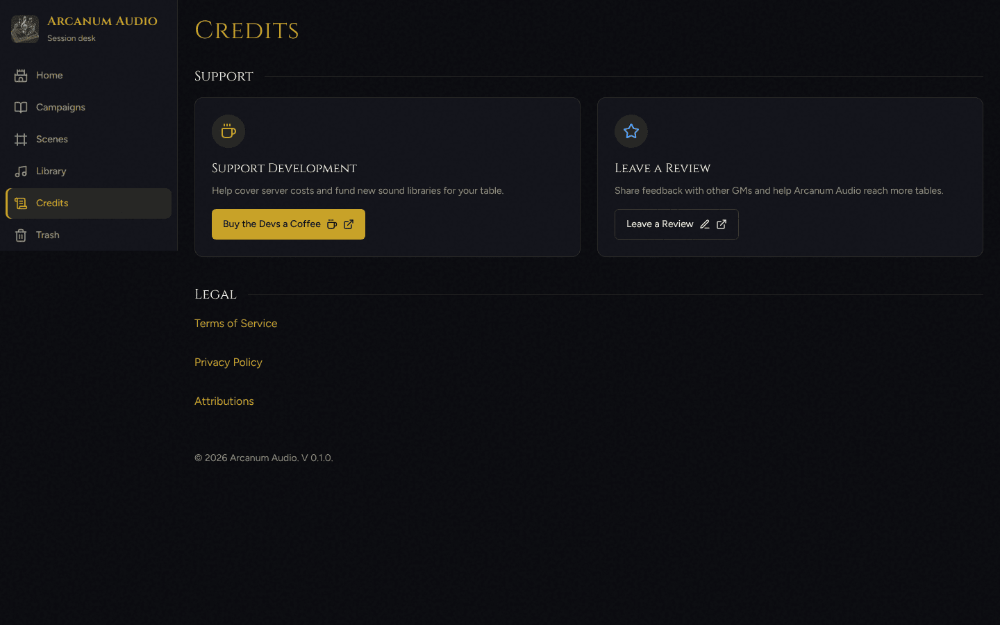

## Stack

| Area | Choice |
|---|---|
| App | Vite 7, React 19, TypeScript, React Router |
| UI | Tailwind CSS 4, Radix Slot, Lucide |
| Unit tests | Vitest, Testing Library |
| Acceptance tests | Cucumber Gherkin (`features/`), Playwright + playwright-bdd (`e2e/`) |
| Runtime | Node.js 20+ (see `.nvmrc`) |

## Project structure

```
├── src/                 # React app (pages, components, hooks, lib, context)
├── features/            # Gherkin acceptance specs by domain
├── e2e/steps/           # Playwright BDD step definitions
├── docs/designs/        # Scene design docs and HTML prototypes
├── docs/screenshots/    # README product screenshots
├── assets/audio/        # Bundled soundscapes and soundboard FX
├── public/              # Static web assets
├── plans/               # Iteration / implementation plans
├── ai/                  # Shared agent and skill definitions
├── .agents/             # Agent/skill copies used by IDE assistants
└── .github/workflows/   # CI, acceptance tests, Pages deploy
```

Key `src/` areas: `pages/` (routes), `components/` (UI by domain), `lib/audio/` (mixer), `context/` (campaign + scene audio), `hooks/`.

## Developer guide

### Prerequisites

- Node.js 20+
- npm (CI uses `npm ci` against `package-lock.json`)

### Setup and scripts

```bash
npm ci

# Dev server (Vite, default http://127.0.0.1:5173)
npm run dev

# Production build + local preview
npm run build
npm run preview

# Quality
npm run typecheck
npm run lint
npm test              # Vitest (once)
npm run test:coverage # Vitest + lcov for SonarCloud
npm run test:watch    # Vitest (watch)

# Acceptance (Playwright BDD)
npm run bddgen
npm run test:e2e      # bddgen + playwright test
# alias:
npm run test:acceptance

# README screenshots (dev server must already be running)
npm run screenshots:readme
```

### SonarCloud Quality Gate (CI)

CI runs Vitest coverage, then a [SonarCloud](https://sonarcloud.io) scan with the Quality Gate enforced (`sonar.qualitygate.wait=true`).

1. Create (or import) the project in SonarCloud and confirm **organization** / **project key** match `sonar-project.properties` (`almantask` / `Almantask_rpg-audio-mixer-web` by default — change the file or CI `args` if your UI keys differ).
2. Add a GitHub Actions repository secret named `SONAR_TOKEN` (SonarCloud analysis token). Do not commit the token.

### CI acceptance tests (manual trigger)

To run acceptance tests only from GitHub Actions:

1. **Actions → Acceptance Tests (Manual) → Run workflow**
2. Optionally set `cucumber_tags` (default `@iter0 or @iter1`) or `cucumber_features` (e.g. `features/platform/can_launch.feature`)
3. Run the workflow — Chromium Playwright suite with generated BDD tests

CLI alternative (requires `gh`):

```bash
gh workflow run acceptance-tests.yml --ref <branch> \
  -f cucumber_tags="@iter0 or @iter1" \
  -f cucumber_features="features/platform/can_launch.feature"
```

### Contributing

See the [implementation plan](plans/plan.md) — the next non-completed iteration is a good place to start.

### Agentic development workflow

Arcanum uses specialized AI agents and skills for product, design, implementation, QA, and review. Definitions live under:

- `.cursor/agents/` / `.agents/agents/` — specialist agents
- `.agents/skills/` / `ai/skills/` — orchestration and domain skills

#### Specialist roles

| Role | Focus |
|---|---|
| `product-owner` | Acceptance criteria and feature boundaries |
| `product-designer` | UX flows, layouts, prototypes |
| `fe-developer` | Production React/TS via Red → Green → Refactor TDD |
| `qa-tester` | Gherkin features and Playwright step definitions |
| `fe-reviewer` | Production architecture, performance, frontend quality |
| `qa-reviewer` | Test architecture, BDD semantics, coverage gaps |
| `audio-specialist` | Web Audio playback, mixing, latency |
| `devops-engineer` | Vite/npm tooling, CI/CD, deploy |
| `principal-po` / `principal-qa` / `principal-engineer` | Strategic peer review gates |

#### Orchestration skills

| Skill | Command | Purpose |
|---|---|---|
| `plan-feature` | `/plan-feature` | Requirements → design → Gherkin → iteration plans |
| `refine-feature` | `/refine-feature` | Update existing specs, designs, and plans |
| `new-feature` | `/new-feature` | Implementation → validation → review → fixes |

Examples:

```text
/plan-feature Plan a new feature: Master Volume mute toggle
/refine-feature Refine the Active Scene soundboard picker filters
/new-feature Implement the Master Volume mute toggle from the plan
```

Consult `ai/skills/<skill>/SKILL.md` (or `.agents/skills/`) for phase details and subagent delegation.

---

## Assets & branding (not open source)

The Apache License 2.0 applies **only** to the source code in this repository.

The following are **not** licensed under Apache 2.0 and are **not open source**:

- Audio files and sound packs
- Preset mixes and curated content
- Icons, logos, artwork, and UI graphics
- Application name and branding

These materials are proprietary and may not be redistributed, resold, or included in derivative works without explicit permission. Forks and derivative works must supply their own audio assets and branding.
